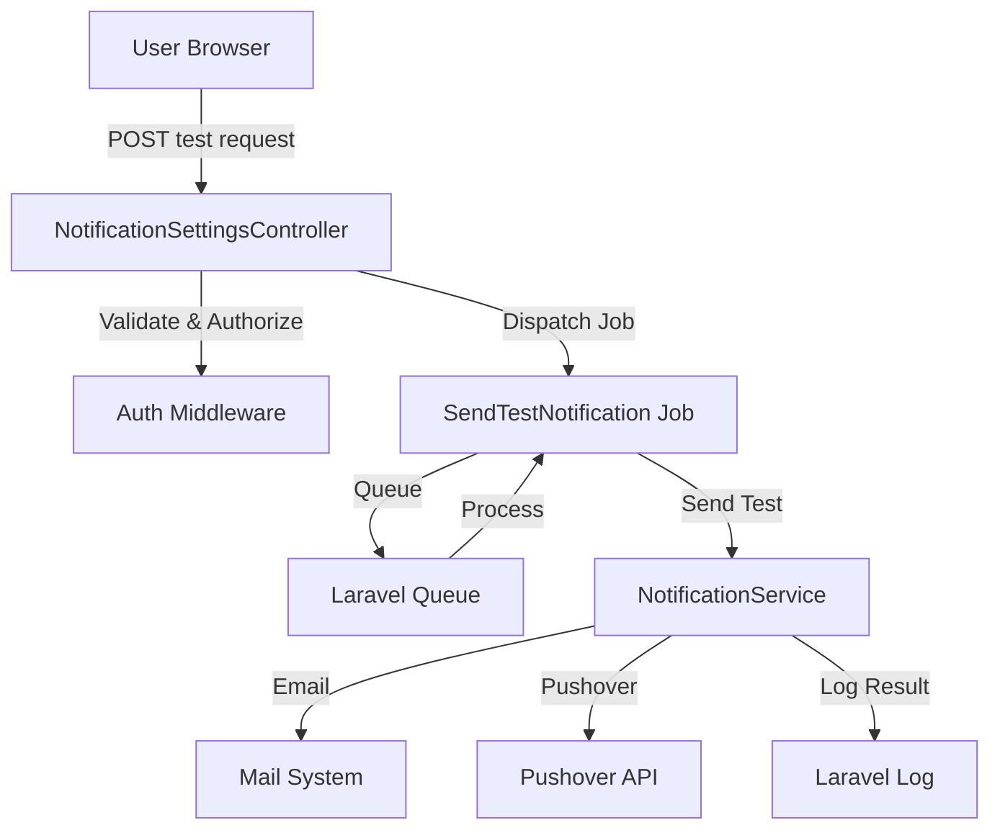

# Design Document: Test Notifications

## Overview

This feature adds the ability for users to send test notifications through both email and Pushover channels directly from the notification settings page. The implementation leverages existing notification infrastructure (NotificationService) and follows Laravel best practices with queued jobs for asynchronous processing.

The feature consists of:
- Two new routes for triggering test notifications (email and Pushover)
- A new queued job for sending test notifications asynchronously
- New methods in NotificationService for sending test messages
- UI enhancements to the notification settings page with test buttons
- Comprehensive error handling and user feedback

## Architecture

### Request Flow

```
User clicks "Send Test Email/Pushover" button
    ↓
POST request to /notification-settings/test-{email|pushover}
    ↓
NotificationSettingsController validates request
    ↓
Dispatches SendTestNotification job to queue
    ↓
Returns immediate success response to user
    ↓
Job executes asynchronously
    ↓
NotificationService sends test notification
    ↓
Success/failure logged
```

### Component Interaction



## Components and Interfaces

### 1. Routes (routes/web.php)

Add two new POST routes within the authenticated middleware group:

```php
Route::post('/notification-settings/test-email', [NotificationSettingsController::class, 'testEmail'])
    ->name('notification-settings.test-email');
    
Route::post('/notification-settings/test-pushover', [NotificationSettingsController::class, 'testPushover'])
    ->name('notification-settings.test-pushover');
```

### 2. NotificationSettingsController

Add two new methods to handle test notification requests:

```php
/**
 * Send a test email notification.
 *
 * @return RedirectResponse
 */
public function testEmail(): RedirectResponse

/**
 * Send a test Pushover notification.
 *
 * @return RedirectResponse
 */
public function testPushover(): RedirectResponse
```

**Responsibilities:**
- Validate user is authenticated
- Verify notification channel is enabled
- Dispatch SendTestNotification job
- Return immediate feedback to user

### 3. SendTestNotification Job

New queued job class: `app/Jobs/SendTestNotification.php`

```php
class SendTestNotification implements ShouldQueue
{
    use Dispatchable, InteractsWithQueue, Queueable, SerializesModels;
    
    public function __construct(
        public User $user,
        public string $channel  // 'email' or 'pushover'
    ) {}
    
    public function handle(NotificationService $notificationService): void
}
```

**Responsibilities:**
- Execute asynchronously via queue
- Call appropriate NotificationService method
- Handle exceptions and log results
- Retry on failure (Laravel default: 1 attempt)

### 4. NotificationService Enhancements

Add two new public methods to the existing NotificationService:

```php
/**
 * Send a test email notification.
 *
 * @param User $user
 * @return void
 * @throws \Exception
 */
public function sendTestEmail(User $user): void

/**
 * Send a test Pushover notification.
 *
 * @param User $user
 * @return void
 * @throws \Exception
 */
public function sendTestPushover(User $user): void
```

**Implementation Details:**
- Reuse existing `sendEmailNotification()` and `sendPushoverNotification()` methods
- Pass test-specific content (subject, message, title)
- Use normal priority (0) for Pushover
- Retrieve credentials from user's NotificationSettings
- Throw exceptions on failure for job retry logic

### 5. Email Template

Create new Blade template: `resources/views/emails/test-notification.blade.php`

**Content:**
- Clear "Test Notification" heading
- Explanation that this is a test message
- Confirmation that email settings are working
- Timestamp of test
- Link back to notification settings

### 6. View Updates

Update `resources/views/notification-settings/edit.blade.php`:

**Email Section:**
- Add "Send Test Email" button below email address field
- Show button only when `email_enabled` is true
- Use secondary button styling
- POST to `notification-settings.test-email` route

**Pushover Section:**
- Add "Send Test Pushover" button below Pushover configuration
- Show button only when `pushover_enabled` is true
- Use secondary button styling
- POST to `notification-settings.test-pushover` route

**Button Implementation:**
```blade
@if($settings->email_enabled)
    <form method="POST" action="{{ route('notification-settings.test-email') }}" class="inline">
        @csrf
        <x-secondary-button type="submit">
            Send Test Email
        </x-secondary-button>
    </form>
@endif
```

## Data Models

No new models or database changes required. The feature uses existing models:

- **User**: Authenticated user triggering the test
- **NotificationSettings**: Contains email/Pushover configuration and credentials

## 
Correctness Properties

*A property is a characteristic or behavior that should hold true across all valid executions of a system-essentially, a formal statement about what the system should do. Properties serve as the bridge between human-readable specifications and machine-verifiable correctness guarantees.*

Property 1: Test button visibility matches notification enabled state
*For any* user with notification settings, the "Send Test Email" button should be visible if and only if email notifications are enabled, and the "Send Test Pushover" button should be visible if and only if Pushover notifications are enabled
**Validates: Requirements 1.1, 2.1**

Property 2: Test notification triggers job dispatch
*For any* authenticated user with enabled notification channel, triggering a test notification should dispatch a SendTestNotification job to the queue
**Validates: Requirements 1.2, 2.2, 4.1**

Property 3: Successful test returns success feedback
*For any* successful test notification send, the system should return a redirect response with a success message
**Validates: Requirements 1.3, 2.3**

Property 4: Failed test returns error feedback
*For any* failed test notification send, the system should return a redirect response with an error message containing failure details
**Validates: Requirements 1.4, 2.4**

Property 5: Test email contains identifying markers
*For any* test email sent, the subject line should contain "Test Notification" and the body should contain content indicating this is a test message
**Validates: Requirements 3.1, 3.2**

Property 6: Test Pushover contains identifying markers
*For any* test Pushover notification sent, the title should contain "Test Notification" and the message should contain content indicating this is a test message
**Validates: Requirements 3.3, 3.4**

Property 7: Test Pushover uses normal priority
*For any* test Pushover notification sent, the priority parameter should be set to 0 (normal priority)
**Validates: Requirements 3.5**

Property 8: Job execution returns immediate response
*For any* test notification request, the HTTP response should be returned immediately without waiting for the queued job to complete
**Validates: Requirements 4.2**

Property 9: Successful job execution is logged
*For any* test notification job that completes successfully, the system should write a log entry indicating successful delivery
**Validates: Requirements 4.3**

Property 10: Failed job execution is logged with details
*For any* test notification job that fails, the system should write a log entry containing error details
**Validates: Requirements 4.4**

Property 11: Test notifications use user's credentials
*For any* test notification sent, the system should use the authenticated user's NotificationSettings for email address and Pushover credentials
**Validates: Requirements 5.5, 6.1**

Property 12: Unauthenticated requests are rejected
*For any* test notification request without authentication, the system should reject the request with a 401 or redirect to login
**Validates: Requirements 6.3**

Property 13: Test notification execution is logged with user context
*For any* test notification sent, the log entry should include the user ID of the user who triggered the test
**Validates: Requirements 6.5**

## Error Handling

### Controller Level

**Validation Errors:**
- User not authenticated → Redirect to login (handled by auth middleware)
- Notification channel not enabled → Redirect back with error message
- No notification settings found → Redirect back with error message

**Example:**
```php
public function testEmail(): RedirectResponse
{
    $user = Auth::user();
    $settings = $user->notificationSettings;
    
    if (!$settings || !$settings->email_enabled) {
        return redirect()
            ->route('notification-settings.edit')
            ->with('error', 'Email notifications are not enabled.');
    }
    
    SendTestNotification::dispatch($user, 'email');
    
    return redirect()
        ->route('notification-settings.edit')
        ->with('success', 'Test email queued. Check your inbox shortly.');
}
```

### Job Level

**Execution Errors:**
- Email send failure → Log error, job fails (can be retried)
- Pushover API failure → Log error with API response, job fails
- Missing credentials → Log error, job fails
- Network timeout → Log error, job fails

**Error Logging:**
```php
public function handle(NotificationService $notificationService): void
{
    try {
        if ($this->channel === 'email') {
            $notificationService->sendTestEmail($this->user);
            Log::info('Test email sent successfully', ['user_id' => $this->user->id]);
        } else {
            $notificationService->sendTestPushover($this->user);
            Log::info('Test Pushover sent successfully', ['user_id' => $this->user->id]);
        }
    } catch (\Exception $e) {
        Log::error("Test {$this->channel} notification failed", [
            'user_id' => $this->user->id,
            'error' => $e->getMessage(),
            'trace' => $e->getTraceAsString(),
        ]);
        throw $e; // Re-throw for job retry logic
    }
}
```

### Service Level

**NotificationService Error Handling:**
- Reuse existing error handling from `sendEmailNotification()` and `sendPushoverNotification()`
- Throw exceptions on failure (caught by job)
- Log detailed error information

## Testing Strategy

### Unit Tests

**NotificationServiceTest:**
- Test `sendTestEmail()` sends email with correct subject and content
- Test `sendTestPushover()` sends Pushover with correct title and message
- Test `sendTestPushover()` uses priority 0
- Test error handling when email fails
- Test error handling when Pushover API fails

**SendTestNotificationJobTest:**
- Test job calls correct NotificationService method based on channel
- Test job logs success on completion
- Test job logs error on failure
- Test job re-throws exceptions for retry logic

**NotificationSettingsControllerTest:**
- Test `testEmail()` requires authentication
- Test `testEmail()` dispatches job when email enabled
- Test `testEmail()` returns error when email disabled
- Test `testPushover()` dispatches job when Pushover enabled
- Test `testPushover()` returns error when Pushover disabled

### Property-Based Tests

Property-based testing will use PHPUnit with custom generators for this feature.

**Test Generators:**
- Generate users with various notification settings configurations
- Generate enabled/disabled states for email and Pushover
- Generate valid and invalid notification credentials

**Property Tests:**

1. **Button Visibility Property** (Property 1)
   - Generate random users with email_enabled true/false
   - Render notification settings view
   - Assert button presence matches enabled state

2. **Job Dispatch Property** (Property 2)
   - Generate random authenticated users with enabled channels
   - Trigger test notification
   - Assert job was dispatched

3. **Success Feedback Property** (Property 3)
   - Generate random users
   - Mock successful notification send
   - Assert response contains success message

4. **Error Feedback Property** (Property 4)
   - Generate random users
   - Mock failed notification send
   - Assert response contains error message

5. **Email Content Property** (Property 5)
   - Generate random users
   - Send test email
   - Assert subject contains "Test Notification"
   - Assert body contains test indicators

6. **Pushover Content Property** (Property 6)
   - Generate random users
   - Send test Pushover
   - Assert title contains "Test Notification"
   - Assert message contains test indicators

7. **Pushover Priority Property** (Property 7)
   - Generate random users
   - Send test Pushover
   - Assert priority parameter is 0

8. **Immediate Response Property** (Property 8)
   - Generate random users
   - Trigger test notification
   - Assert response returned before job execution

9. **Success Logging Property** (Property 9)
   - Generate random users
   - Execute job successfully
   - Assert log contains success entry

10. **Error Logging Property** (Property 10)
    - Generate random users
    - Force job failure
    - Assert log contains error with details

11. **Credential Usage Property** (Property 11)
    - Generate random users with various credentials
    - Send test notification
    - Assert user's credentials were used

12. **Authentication Property** (Property 12)
    - Attempt test notification without authentication
    - Assert request is rejected

13. **User Context Logging Property** (Property 13)
    - Generate random users
    - Send test notification
    - Assert log contains user ID

### Integration Tests

**Full Flow Tests:**
- Test complete flow from button click to email delivery
- Test complete flow from button click to Pushover delivery
- Test queue processing of test notification jobs
- Test error handling across all layers

**UI Tests:**
- Verify buttons appear/disappear based on settings
- Verify success/error messages display correctly
- Verify CSRF protection on test routes

## Implementation Notes

### Reusing Existing Code

The implementation should maximize code reuse:

1. **NotificationService Methods:**
   - `sendTestEmail()` calls existing `sendEmailNotification()` with test parameters
   - `sendTestPushover()` calls existing `sendPushoverNotification()` with test parameters

2. **Email Templates:**
   - Create new `test-notification.blade.php` template
   - Reuse existing email layout and styling

3. **Error Handling:**
   - Leverage existing exception handling in NotificationService
   - Use same logging patterns as monitor checks

### Security Considerations

1. **Authentication:** All test routes protected by `auth` middleware
2. **Authorization:** Implicit - users can only test their own settings (via Auth::user())
3. **Rate Limiting:** Consider adding rate limiting to prevent abuse
4. **CSRF Protection:** All POST requests include CSRF token

### Performance Considerations

1. **Async Processing:** Jobs execute asynchronously to avoid blocking UI
2. **Queue Configuration:** Use existing database queue driver
3. **Job Retries:** Default Laravel retry logic (1 attempt)
4. **Timeout:** Email/Pushover operations have reasonable timeouts

### User Experience

1. **Immediate Feedback:** User sees success message immediately after clicking button
2. **Clear Messaging:** Success message indicates notification was queued
3. **Error Clarity:** Error messages explain what went wrong
4. **Visual Consistency:** Test buttons use secondary button styling to differentiate from primary actions

## Dependencies

- **Laravel Framework:** 12.x
- **Laravel Queue:** Database driver (already configured)
- **Laravel Mail:** SMTP configuration (already configured)
- **Pushover API:** Existing integration in NotificationService
- **PHPUnit:** 11.5+ for testing

## Migration Requirements

No database migrations required. Feature uses existing tables and models.

## Configuration Requirements

No new configuration required. Feature uses existing:
- Mail configuration (`.env`: `MAIL_*` variables)
- Pushover configuration (`.env`: `PUSHOVER_USER_KEY`, `PUSHOVER_API_TOKEN`)
- Queue configuration (`.env`: `QUEUE_CONNECTION=database`)
