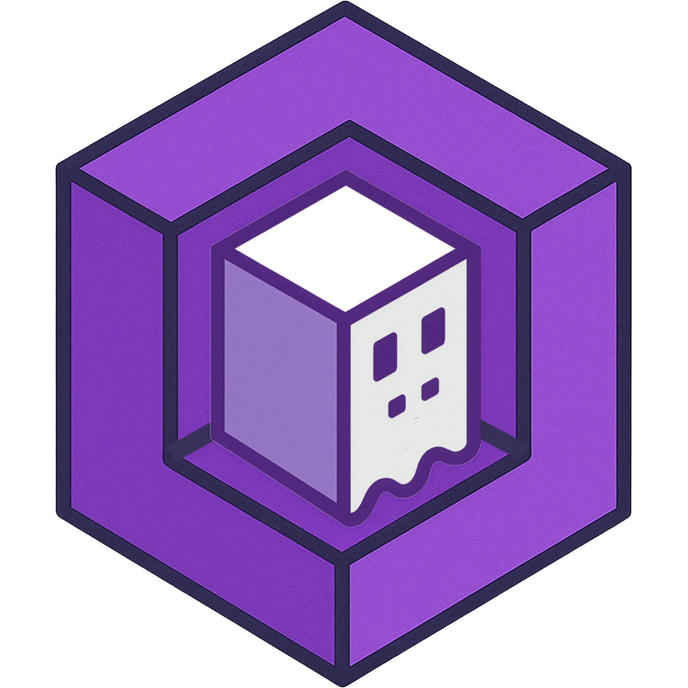
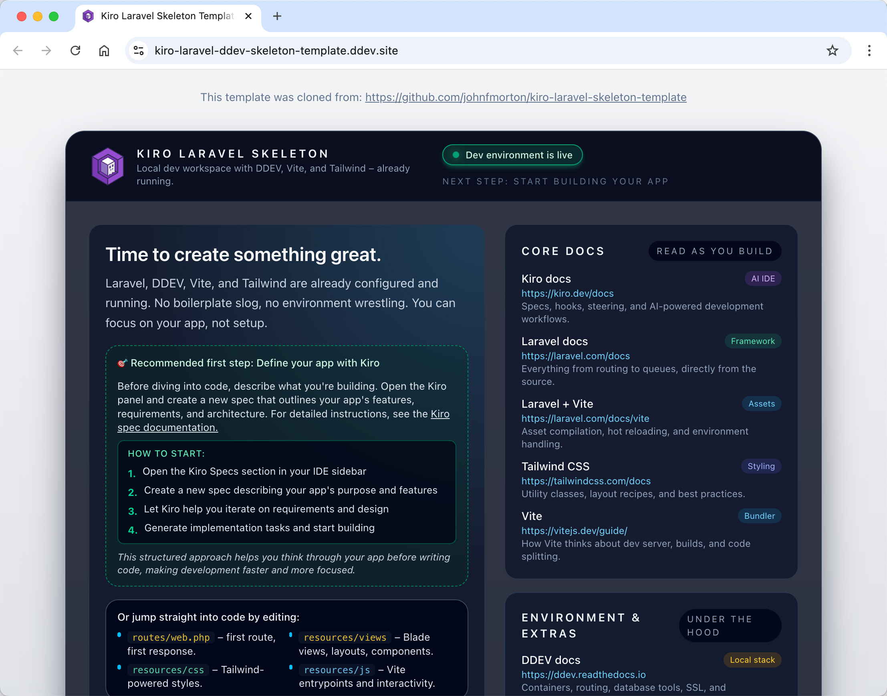
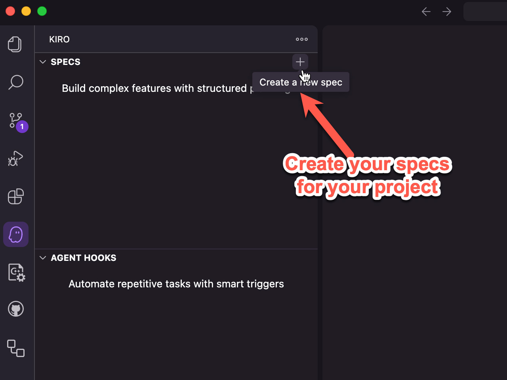

<p align="center">
  
</p>

# Kiro Laravel Skeleton

Build smarter with [Kiro](https://kiro.dev/ "Kiro homepage") and [Laravel](https://laravel.com "Laravel homepage") together: a clean, consistent starting point for any new project.



## Introduction

The **Kiro Laravel Skeleton** is preconfigured Laravel environment designed to turn Kiro output into profession-level code with minimal setup friction.

This template makes building a Laravel app with Kiro simple. Kiro gives you the structure to design your app, and this skeleton turns that structure into a working Laravel project the moment you clone it. DDEV, Vite, Tailwind CSS, Mailpit, and hot-module reloading are already wired together, so you can focus on implementation instead of configuration.

It also includes production-tested steering documents shaped by real-world Laravel development. These documents translate Kiro’s planning into consistent conventions, solid architecture, and clear workflows—making it easier to write maintainable code from day one.


## Features

* Laravel Ready: Comes pre-configured with a complete Laravel setup tailored for local development using DDEV.
* Vite Integration: Includes a Vite build process with hot module reloading, making front-end development smooth and efficient.
* Kiro Specs: Comes with highly tuned Kiro spec documents to ensure your code is human-readable and well-structured from the start.
* Makefile Included: Start your project simply by running make dev for an easy, no-fuss development experience.

## DDEV Requirements

Since the project uses DDEV for local enviroment of your Laravel project, you'll need to have DDEV installed on your development machine. See the [DDEV getting started section](https://ddev.com/get-started/) of the documenation for instructions for Mac, Windows and Linux. Basically, you'll need to be able to install Docker images, and, depending on your platform, a way for local URLs to resolve.

### Automatic DDEV Validation

This project includes automatic DDEV installation checks that run before any DDEV-dependent commands. When you run `make setup`, `make dev`, or `make build`, the system will automatically verify that:

* DDEV is installed and available in your PATH
* DDEV can execute commands successfully
* Docker is running and accessible to DDEV

If any issues are detected, you'll receive clear error messages with specific troubleshooting steps. This ensures you don't encounter cryptic errors during setup.

**Note**: The `make help` command does not require DDEV and will always work, even if DDEV is not installed.

## Quick Start

1. **Clone the repo**: `git clone <https://github.com/johnfmorton/kiro-laravel-skeleton.git> your-project-name`
2. **Navigate to the directory**: `cd your-project-name`
3. **Run initial setup**: `make setup` (automatically checks DDEV, then installs dependencies, generates app key, runs migrations, builds assets)
4. **Start development**: `make dev` (automatically checks DDEV, then launches browser, runs migrations, starts Vite dev server)
5. **Create your Kiro specs**: open your project in Kiro, create specs for your project, and begin building your app



Your Laravel app will be running at the URL shown by DDEV (typically `https://your-project-name.ddev.site`).

**First-time users**: If you don't have DDEV installed, `make setup` will detect this and provide installation instructions with platform-specific commands.

## Daily Development

After initial setup, just run:

```bash
make dev      # Launch your development environment
```

## Contribution and License

This project is open source under the MIT License. We welcome contributions and suggestions!
