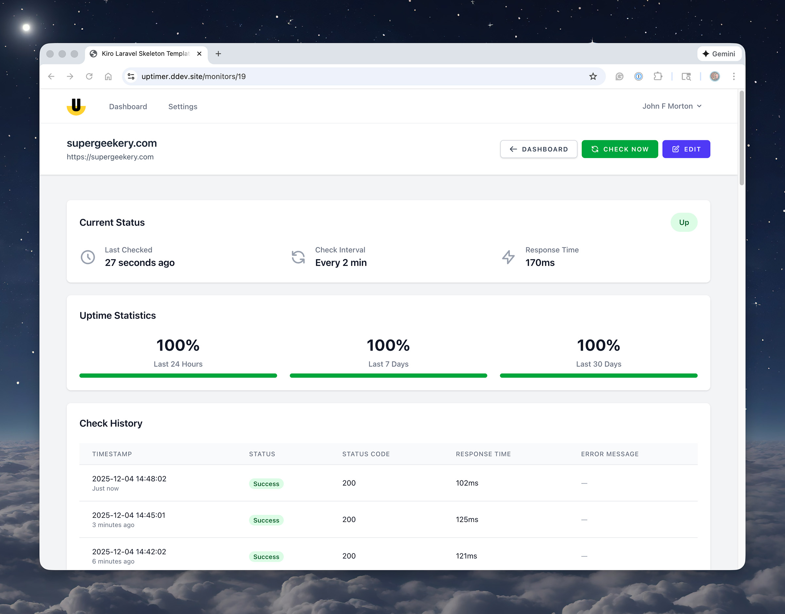

# Uptimer

<p align="center">
  
</p>

A Laravel-based uptime monitoring application that helps you track website availability and receive instant notifications when your sites go down or recover.


## Features

- 🔍 **HTTP Monitoring** - Periodic checks of website availability with configurable intervals
- 📧 **Email Notifications** - Receive detailed alerts via email when status changes
- 📱 **Pushover Integration** - Get instant push notifications on your mobile device
- 📊 **Uptime Statistics** - Track reliability with 24-hour, 7-day, and 30-day uptime percentages
- 📝 **Check History** - View detailed history of all checks with timestamps, status codes, and response times
- ⚡ **Background Processing** - Asynchronous checks using Laravel queues for optimal performance
- 🔐 **Controlled Registration** - Secure access with optional public registration control
- 🎨 **Modern UI** - Clean, responsive interface built with Tailwind CSS and Alpine.js

[


## Quick Start

### Prerequisites

- PHP 8.2 or higher
- Composer 2
- Node.js and NPM
- DDEV (for local development)
- MySQL 8.4 or SQLite

### Installation

1. **Clone the repository**
   ```bash
   git clone <repository-url> uptimer
   cd uptimer
   ```

2. **Start DDEV environment**
   ```bash
   ddev start
   ```

3. **Run setup**
   ```bash
   ddev composer run setup
   ```

4. **Create an admin user**
   ```bash
   ddev artisan user:create-admin
   ```

5. **Start development environment**
   ```bash
   ddev composer run dev
   ```

6. **Access the application**
   
   Open your browser to the URL shown by DDEV (typically `https://kiro-laravel-ddev-skeleton-template.ddev.site`)

## Documentation

Comprehensive documentation is available in the `documentation` directory:

- **[Setup Guide](documentation/setup.md)** - Complete installation and configuration instructions
- **[Usage Guide](documentation/usage.md)** - How to monitor sites and configure notifications
- **[Deployment Guide](documentation/deployment.md)** - Production deployment instructions
- **[Environment Variables](documentation/environment-variables.md)** - Configuration reference

## Environment Configuration

After installation, configure your application by editing the `.env` file:

```bash
cp .env.example .env  # If starting fresh
```

### ⚠️ Important: Refreshing Configuration in Production

When you modify the `.env` file on a production server, you must refresh the configuration cache:

```bash
php artisan env:refresh
```

Or manually clear caches:

```bash
php artisan optimize:clear
php artisan config:cache  # Re-cache for performance
```

This ensures your environment changes are properly loaded by Laravel.

## How It Works

1. **Add Monitors** - Configure URLs you want to monitor with custom check intervals
2. **Automatic Checks** - Laravel scheduler triggers checks every minute, queuing jobs for each monitor
3. **Background Processing** - Queue workers execute HTTP checks asynchronously
4. **Status Tracking** - Results are stored with timestamps, status codes, and response times
5. **Smart Notifications** - Receive alerts only when status changes (up → down or down → up)
6. **View Statistics** - Dashboard displays current status, uptime percentages, and check history

## Technology Stack

- **Backend**: Laravel 12 (PHP 8.4)
- **Frontend**: Blade templates, Tailwind CSS 4, Alpine.js, Vite 7
- **Database**: SQLite (default) or MySQL 8.4
- **Queue**: Database driver (easily migrated to Redis)
- **Development**: DDEV local environment with nginx-fpm

## Key Commands

### Development
```bash
ddev composer run dev      # Start all services (server, queue, logs, vite)
ddev artisan serve         # Laravel development server only
ddev npm run dev           # Vite dev server only
```

### User Management
```bash
ddev artisan user:create-admin    # Create admin user via CLI
```

### Queue & Scheduler
```bash
ddev artisan queue:work --tries=1  # Start queue worker
ddev artisan schedule:run          # Run scheduled tasks manually
ddev artisan pail                  # View real-time logs
```

### Testing
```bash
ddev composer run test     # Run test suite
ddev artisan test          # Run PHPUnit tests
```

### Code Quality
```bash
ddev exec ./vendor/bin/pint        # Format code with Laravel Pint
```

## Configuration

Key environment variables in `.env`:

```env
# Public Registration Control
ALLOW_PUBLIC_REGISTRATION=false

# HTTP Check Timeout (seconds)
CHECK_TIMEOUT=30

# Check History Retention (days)
CHECK_RETENTION_DAYS=30

# Email Configuration
MAIL_MAILER=smtp
MAIL_FROM_ADDRESS="noreply@example.com"

# Pushover Notifications (optional)
PUSHOVER_USER_KEY=your-user-key
PUSHOVER_API_TOKEN=your-api-token
```

See [Environment Variables](documentation/environment-variables.md) for complete reference.

### Check History Retention

By default, check history is automatically deleted after 30 days to prevent database growth. This runs daily at 2:00 AM.

- **Configure retention**: Set `CHECK_RETENTION_DAYS` in `.env` (default: 30)
- **Manual cleanup**: `ddev artisan checks:prune`
- **Custom retention**: `ddev artisan checks:prune --days=7`
- **Keep all history**: Set `CHECK_RETENTION_DAYS=0` (not recommended)

See [CHECK_RETENTION_POLICY.md](CHECK_RETENTION_POLICY.md) for detailed documentation.

## Architecture

The application follows Laravel's MVC architecture with service layers:

```
Web Interface (Blade + Tailwind CSS)
         ↓
    Controllers
         ↓
   Service Layer
   - MonitorService (CRUD operations)
   - CheckService (HTTP checks)
   - NotificationService (Email & Pushover)
         ↓
    Models & Queue Jobs
         ↓
      Database
```

### Key Components

- **Monitors** - Store URL, check interval, and current status
- **Checks** - Record each check result with timestamp and details
- **Queue Jobs** - Background processing for HTTP checks
- **Scheduler** - Triggers checks every minute based on intervals
- **Notifications** - Email and Pushover alerts on status changes

## Security

- **Controlled Registration** - Public registration disabled by default
- **Admin User Creation** - CLI command for creating users without web access
- **Authentication** - Laravel Breeze for secure user authentication
- **Environment Variables** - Sensitive data stored in `.env` (not committed)

## Contributing

This project follows Laravel best practices:

- PSR-12 code style (enforced with Laravel Pint)
- Type-safe code with strict typing (`declare(strict_types=1)`)
- Comprehensive test coverage (unit, feature, and property-based tests)
- Service layer architecture for maintainability
- Clear separation of concerns

## License

This project is open-sourced software licensed under the [MIT license](LICENSE).

## Support

- **Documentation**: Start with the [Setup Guide](documentation/setup.md)
- **Issues**: Check application logs with `ddev artisan pail`
- **Troubleshooting**: See [Setup Guide - Troubleshooting](documentation/setup.md#troubleshooting)

## Built With Kiro

This application was built using [Kiro](https://kiro.dev/), an AI-powered IDE that helps developers build Laravel applications faster. The project structure and steering documents are optimized for Kiro's spec-driven development workflow.

---

**Ready to monitor your sites?** Start with the [Setup Guide](documentation/setup.md) to get up and running in minutes.
